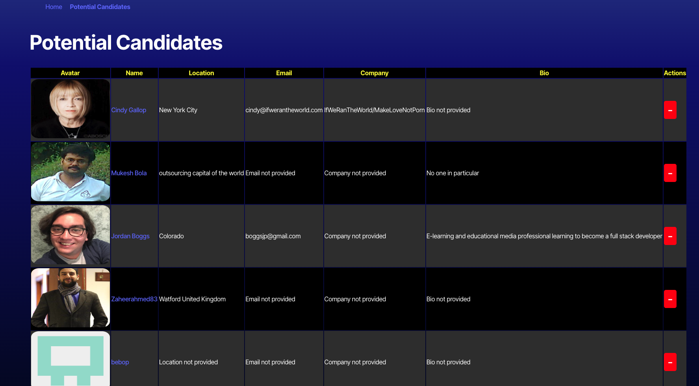

# Candidate_Search

# Description
The purpose of this project was to build an app using Github API to find potential candidates to hire. This app will give recruiters the ability to search through potential candidates on Github, save the ones they are interested in and skip over the ones they are not interested in. 

## Challenge
One of my main challenges was getting the API data to render on both pages. After hours of reviewing my code I could not figure it out. I was able to get help from my tutor and he explained to me what I was missing. The main thing I was missing was in vite.config.ts. The starter code came with a folder named "environment," and inside the folder was .env. In vite.config.ts, I used envDir: './env', but since the .env was inside the environment folder, it should have been written like this: envDir: './environment.' As soon as I made this change, the api data was showing on both pages. 

 ## Table of Contents
  * [Installation](#installation)
  * [Usage](#usage)
  * [License](#license)
  * [Contributing](#contributing)
  * [Credits](#credits)
  * [Questions](#questions)
  

  ## Installation
  To install the necessary dependencies, run the following command:
  - npm install
  - npm run build 
  - npm run start

 

  ## Usage
  
  ## Here is the main pages
  
  
  
  CHeck out my deploy link here [Candidate Search]()
  

  ## Credits 
  Starter code credit to Rutgers boot camp 

  ## License
  This project is license under MIT. 
    
    
    
    
  
  
  ## Contributing
  According to github, on learning how to contribute to someones repo, you can use a fork and pull request1. 
  Here is a link to the github documentation on how to fork and pull request: [Github Documentation](https://docs.github.com/en/get-started/exploring-projects-on-github/contributing-to-a-project)
  Since this is an open source project, check out the this link on contributor covenant: [Contributor Covenant](https://www.contributor-covenant.org/) This is a code of conduct for open source projects.
  

  
  ## Questions
  If you have any questions about this repo, please contact me directly at marqueljamal12@gmail.com. You can find more of my work on github at [marquel12](https://github.com/marquel12/Candidate_Search) 
